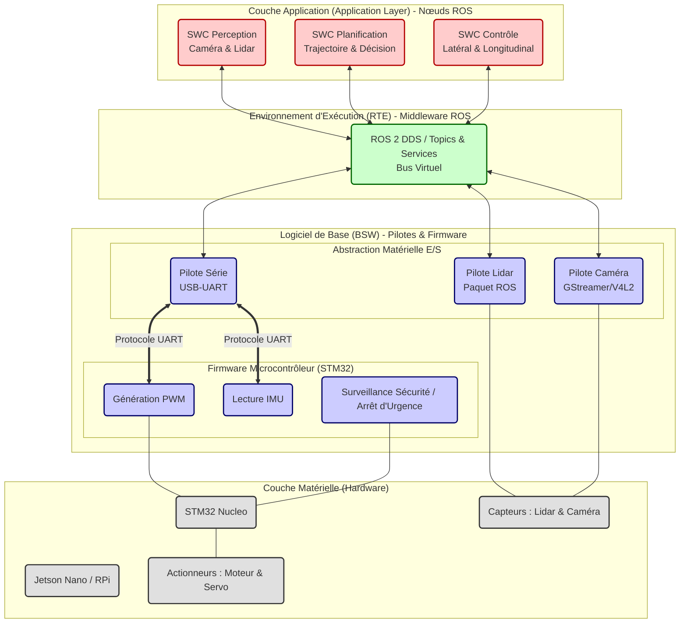

# Firmware Description
📦 Firmware overview for Projet_Industriel_2026

## Overview
This page describes the firmware architecture, build and flash workflow, and practical tips for development and debugging.

## Architecture (high level)

---

## Detailed Hardware I/O Architecture

For a comprehensive view of all hardware connections, communication protocols, and pinout details, see the **[I/O Architecture Diagram](./IO_Architecture_Diagram.md)**.

This detailed diagram shows:
- All 17 I/O signal connections
- Complete hardware interface specifications (UART, USB, I2C, PWM, GPIO)
- Pinout mappings for Raspberry Pi and STM32
- Power distribution (7.2V battery → 5V regulation)
- Communication protocols with data rates and voltage levels
- Safety mechanisms (emergency stop)

**Quick Links:**
- 📊 [Interactive I/O Diagram](./IO_Architecture_Diagram.md) - Mermaid visualization with color-coded components
- 📋 [I/O Signal List](../Architecture/CoVAPSy_IO_Bilan_v1.0_2025-11-25.xlsx) - Complete Excel specification
