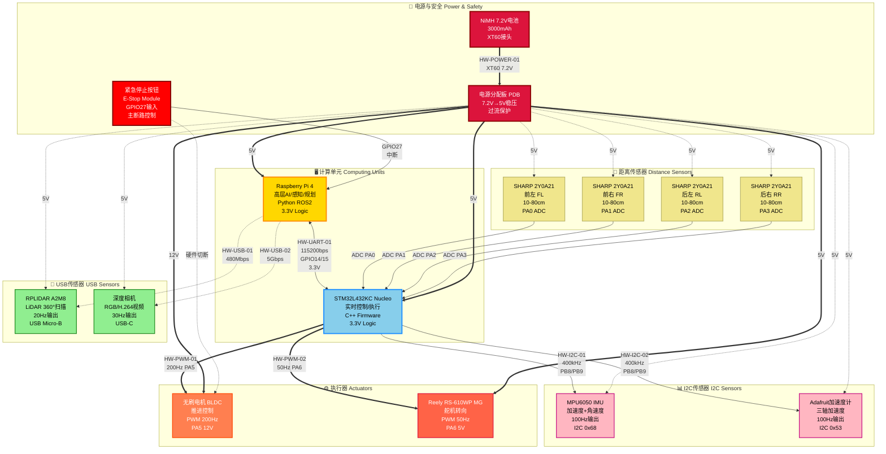

# CoVAPSy I/O连接架构图

> **文档版本:** v1.0
> **创建日期:** 2025-11-25
> **用途:** 展示系统完整的I/O连接关系,便于团队理解硬件架构

---

## 📊 系统I/O连接总览

下图展示了CoVAPSy自主车辆的完整I/O连接架构,包括:
- 双处理器架构 (Raspberry Pi 4 + STM32L432KC)
- 所有传感器输入 (LiDAR, Camera, IMU, 加速度计, 4个距离传感器)
- 执行器输出 (电机, 舵机)
- 电源分配 (7.2V电池 → 5V稳压)
- 安全机制 (紧急停止)



---

## 🎨 图例说明

### 颜色编码

| 颜色 | 组件类型 | 说明 |
|------|---------|------|
| 🟡 金色 | Raspberry Pi | 高层AI处理器 |
| 🔵 天蓝色 | STM32 | 实时控制微控制器 |
| 🟢 浅绿色 | USB传感器 | LiDAR和摄像头 |
| 🌸 浅粉色 | I2C传感器 | IMU和加速度计 |
| 🟨 Khaki色 | 模拟传感器 | 距离传感器 |
| 🟠 珊瑚色 | 电机 | 推进执行器 |
| 🔴 番茄色 | 舵机 | 转向执行器 |
| 🔴 深红色 | 电源系统 | 电池和分配板 |
| 🔴 纯红色 | 紧急停止 | 安全关键 |

### 连接线类型

| 线型 | 通信协议 | 说明 |
|------|---------|------|
| `<-->` 实线双向箭头 | UART | RPi ↔ STM32双向通信, 115200 bps |
| `-.->` 虚线箭头 | USB | 高速数据传输 (480Mbps/5Gbps) |
| `-->` 实线单向箭头 | I2C/GPIO | I2C总线400kHz或ADC输入 |
| `==>` 加粗箭头 | PWM/Power | PWM控制信号或电源线 |

---

## 📋 通信协议总结表

| 接口ID | 接口类型 | 连接设备 | 速率/频率 | 电压 | 引脚 | 用途 |
|--------|---------|---------|----------|------|------|------|
| HW-UART-01 | UART | RPi ↔ STM32 | 115200 bps | 3.3V | GPIO14/15 ↔ PA9/PA10 | 主通信桥梁 |
| HW-USB-01 | USB 2.0 | RPi → LiDAR | 480 Mbps | 5V | USB Port | 环境扫描数据 |
| HW-USB-02 | USB 3.0 | RPi → Camera | 5 Gbps | 5V | USB Port | 视觉感知数据 |
| HW-I2C-01 | I2C | STM32 → IMU | 400 kHz | 3.3V | PB8/PB9 | 惯性测量数据 |
| HW-I2C-02 | I2C | STM32 → Accel | 400 kHz | 3.3V | PB8/PB9 | 加速度数据 |
| HW-GPIO-01~04 | Analog | STM32 ← Sensors | N/A | 5V | PA0-PA3 | 距离测量 |
| HW-PWM-01 | PWM | STM32 → Motor | 200 Hz | 12V | PA5 | 电机油门控制 |
| HW-PWM-02 | PWM | STM32 → Servo | 50 Hz | 5V | PA6 | 舵机角度控制 |
| HW-GPIO-05 | GPIO | RPi ← E-Stop | N/A | 3.3V | GPIO27 | 紧急停止输入 |
| HW-POWER-01 | Power | Battery → PDB | N/A | 7.2V → 5V | XT60 | 电源分配 |

---

## 🔍 系统架构分析

### 数据流向

1. **感知输入流:**
   ```
   传感器 → RPi/STM32 → 感知节点 → 规划节点
   - LiDAR/Camera → RPi (USB)
   - IMU/Accel/Distance → STM32 (I2C/ADC) → RPi (UART)
   ```

2. **控制输出流:**
   ```
   规划节点 → 控制节点 → STM32 → 执行器
   - RPi → STM32 (UART) → Motor/Servo (PWM)
   ```

3. **安全联锁:**
   ```
   E-Stop → RPi (GPIO中断) → 软件停止
   E-Stop → Motor (硬件切断) → 立即断电
   ```

### 电源分配树

```
NiMH 7.2V 3000mAh电池
  └─ 电源分配板 (PDB)
      ├─ 5V输出 (稳压)
      │   ├─ Raspberry Pi 4
      │   ├─ STM32L432KC
      │   ├─ 舵机
      │   ├─ LiDAR
      │   ├─ Camera
      │   ├─ IMU
      │   ├─ 加速度计
      │   └─ 4个距离传感器
      └─ 12V输出 (直连或升压)
          └─ 无刷电机
```

### 通信频率层次

| 频率等级 | 通信类型 | 应用 | 延迟要求 |
|---------|---------|------|---------|
| **实时 (>100Hz)** | UART, I2C | STM32控制循环 | <10ms |
| **高频 (20-50Hz)** | ROS2 DDS | 感知与规划 | <50ms |
| **中频 (10-20Hz)** | LiDAR | 环境扫描 | <100ms |
| **低频 (<10Hz)** | 电池监测 | 安全检查 | <1s |

---

## 📖 使用指南

### 硬件工程师
- 查看组件间的物理连接和引脚分配
- 确认电压等级和电流容量
- 验证连接器类型和线序

### 固件工程师 (STM32)
- 理解需要配置的外设: UART, I2C, ADC, PWM, GPIO
- 确认中断源: IMU数据就绪, E-Stop触发
- 了解实时约束: PWM频率, I2C速率

### 软件工程师 (ROS2)
- 掌握RPi与STM32的UART通信协议
- 理解传感器数据流向和频率
- 设计ROS2节点间的数据管道

### 系统集成工程师
- 全局视图: 所有I/O连接一目了然
- 电源预算: 计算总功耗和电池续航
- 故障诊断: 追踪信号路径定位问题

---

## 🔗 相关文档

- **[I/O清单Excel文档](../Architecture/CoVAPSy_IO_Bilan_v1.0_2025-11-25.xlsx)** - 详细的I/O信号和接口规格
- **[固件架构文档](./Firmware.md)** - 4层软件架构设计
- **[系统架构图](../Architecture/Archi_v2.drawio)** - Draw.io源文件
- **[材料清单](../Architecture/liste des composants .xlsx)** - 硬件组件列表

---

## 📝 更新记录

| 版本 | 日期 | 修改内容 | 作者 |
|------|------|---------|------|
| v1.0 | 2025-11-25 | 初始版本,创建完整I/O连接图 | Integration Team |

---

## 💡 提示

- 在GitHub/GitLab上查看此文档可获得Mermaid图表的完整交互式渲染
- 使用VS Code的Mermaid插件可实时预览编辑效果
- 图表源代码可导出为SVG/PNG用于演示文稿
- 建议定期与Excel清单和实际硬件保持同步更新

